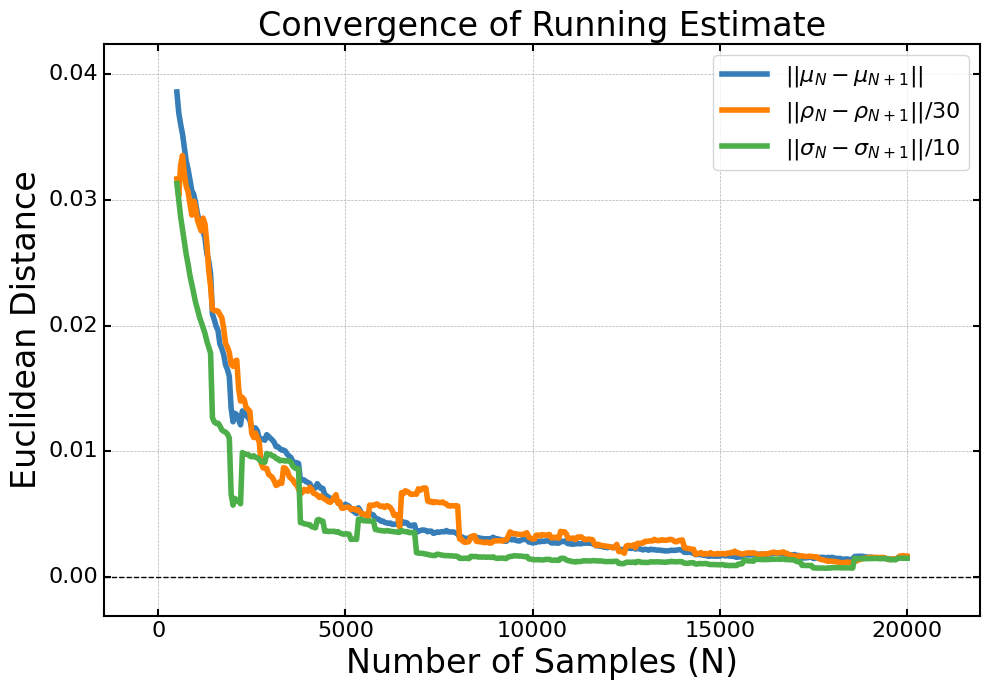
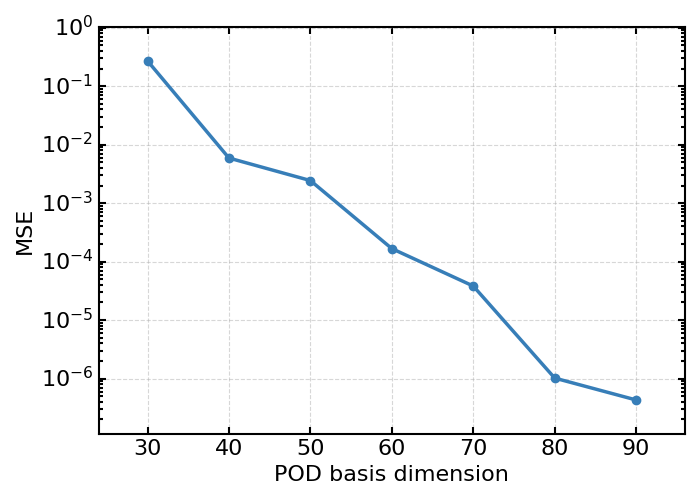
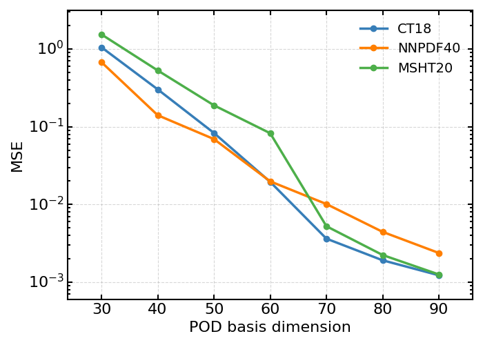

# A linear PDF model for robust Bayesian inference

This repository holds all code and instructions to reproduce the results and figures of “[My Paper Title](link-to-published-paper)”.


## Getting Started

1. **Clone the repo**  
   ```bash
   git clone git@github.com:comane/NNPOD-wiki.git
   cd my-paper

2. **Create the environment**

---

## Quick Preview of Figures

| Figure | Preview                              | Source Notebook                                 |
|--------|--------------------------------------|-------------------------------------------------|
| Fig. 2  |         | [reproduce_fig2](Notebooks/sampled_mean_and_variance.ipynb) |
| Fig. 3 left |  | [reproduce_fig3_l](Notebooks/completeness.ipynb) |
| Fig. 3 right |  | [reproduce_fig3_r](Notebooks/generalisation.ipynb) |
| Fig. 4 | | [reproduce_fig4](Notebooks/completeness.ipynb) |
| Fig. 5 | | [reproduce_fig5](Notebooks/generalisation.ipynb) | 

---


