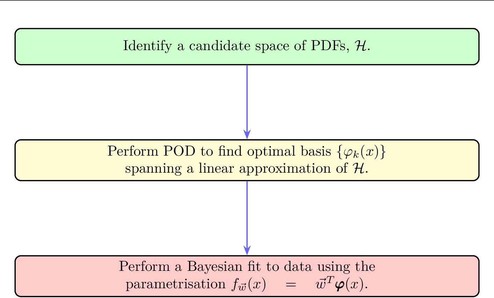
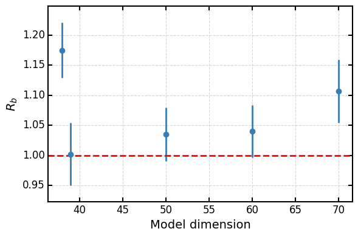

# A linear PDF model for Bayesian inference

> Code & instructions to reproduce all numerical results and figures from  “[A linear PDF model for Bayesian inference](...)”.


<p align="center">
  
  <br>
  <em>Bayesian fitting workflow diagram</em>
</p>


## Getting Started

**Create the environment**

In order to use the runcards and notebooks of this repository, you need to first build the right conda environment.
To do so you can follow the instructions on https://github.com/HEP-PBSP/wmin-model/
  

---
##  Quick Preview of Figures

| **Figure** |            **Preview**             |            **Source Notebook**             |
|:----------:|:----------------------------------:|:------------------------------------------:|
| **Fig. 2** |  | [reproduce_fig2](notebooks/sampled_mean_and_variance.ipynb) |
| **Fig. 3 L** |  | [reproduce_fig3_l](notebooks/completeness.ipynb) |
| **Fig. 3 R** |  | [reproduce_fig3_r](notebooks/generalisation.ipynb) |
| **Fig. 4** |                                    | [reproduce_fig4](notebooks/completeness.ipynb)      |
| **Fig. 5** |                                    | [reproduce_fig5](notebooks/generalisation.ipynb)    |
| **Fig. 7** |  | [reproduce_fig7](section5)                          |
| **Fig. 9** |  | [reproduce_fig9](section5)                          |


---

## Reproducing results of section 3

The [section 3](section3) folder contains the info for reproducing results from section 3 of the paper.

## Reproducing results of section 5

The [section 5](section5) folder contains the info for reproducing results from section 5 of the paper.

1. Section 5.2: to reproduce these results follow the instructions [here](https://github.com/comane/NNPOD-wiki/tree/main/section5#validation-of-model-selection-strategy)
2. Section 5.3: to reproduce these results follow the instructions [here](https://github.com/comane/NNPOD-wiki/tree/main/section5#uncertainty-quantification-in-the-data-region)


## Citing This Work

If you use this repository or the results in your own research, please cite our paper as follows:

### BibTeX

```bibtex
TODO
```
