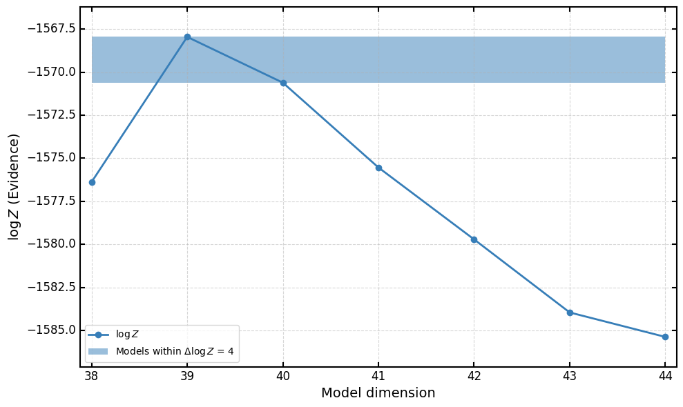

In this section we discuss the closure test results used to validate the model selection and uncertainty quantification.

## Choice of underlying law

The underlying law used in these closure test fits has been generated using this [notebook](../notebooks/underlying_law.ipynb).

## Validation of model selection strategy

To validate our model-selection strategy, we perform a scan over a family of models with
progressively increasing complexity, each fitted to the same instance of Level 1 data. By
comparing the Bayesian evidence for each model, we verify that the inference procedure
correctly identifies the model with the appropriate number of parameters, thus preventing
both underfitting and overfitting.

In this repository we provide both the [analytical](../runcards/template_analytical_L1.yaml) as well as the [numerical](../runcards/template_numerical_L1.yaml) template cards containing all of the fit-specs, data and actions used in this section. We also provide two python scripts, one for the [analytical](../runcards/run_parallel_analytic.py) and one for the [numerical](../runcards/run_parallel_num.py) that can be used for running a model scan.

> **Note:**  
> The fitting strategy adopted, as described in section 4 of the paper, is based on a Bayesian update strategy.
> Because of this we provide the two runcard templates separately.

For plotting purposes (eg Fig 7 of the paper) we provide the User with the following [notebook](../notebooks/l1_model_scan.ipynb).

 

## Uncertainty quantification in the data-region